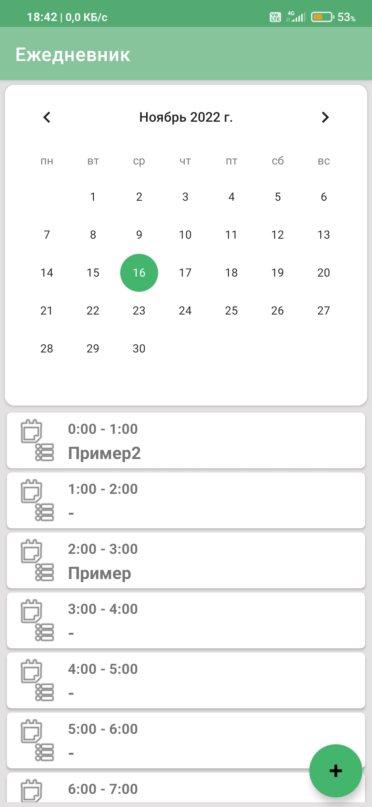
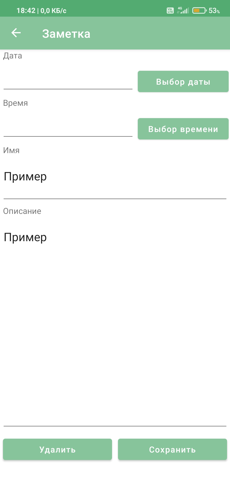
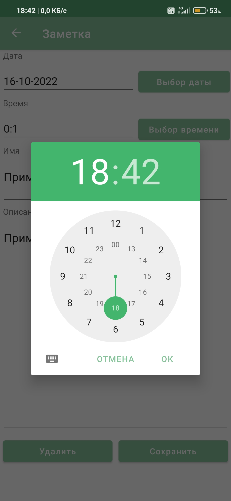
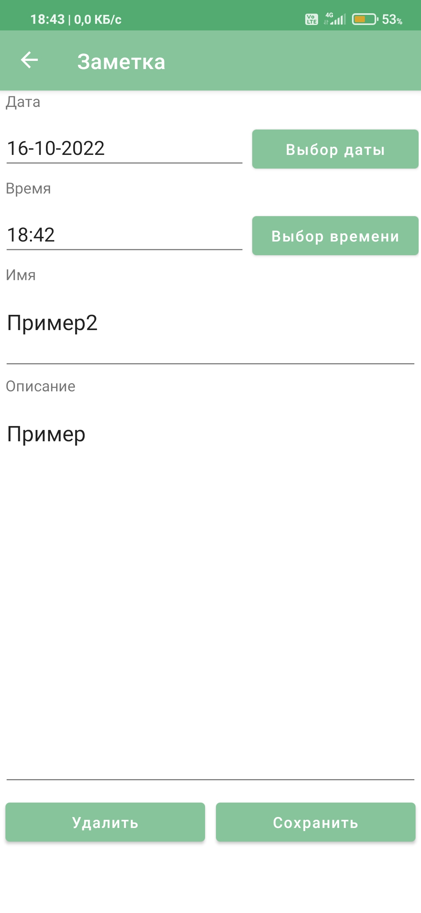
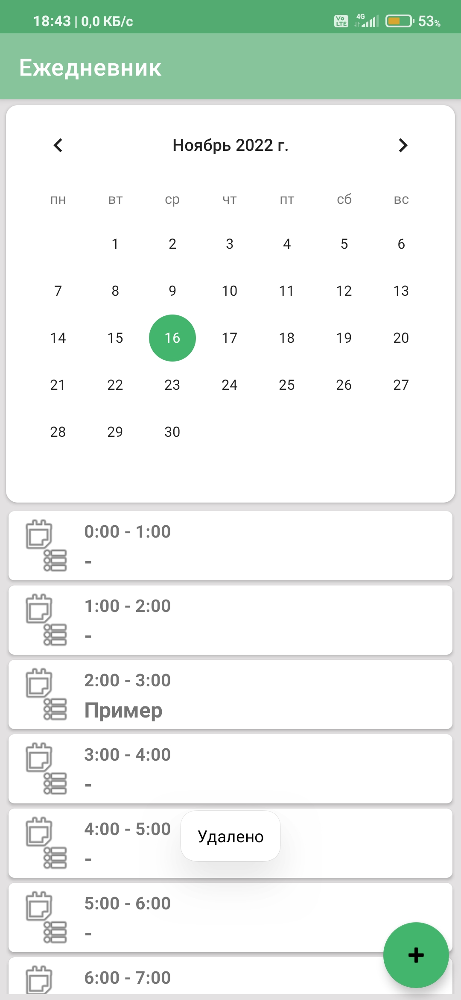
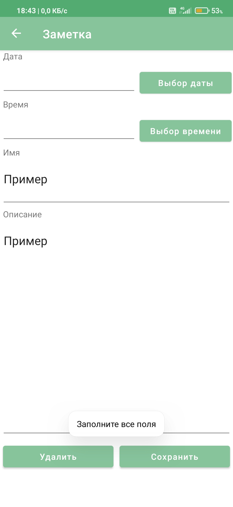

# DailyNotesCalendar
Приложение календарь с заметками
# About
Приложение, в котором можно создать заметку по клику на кнопку "+" в нижнем правом углу экрана. Нужно заполнить все поля,
иначе выдается тост "Заполните все поля". 
Заметки сортируются и отображаются по датам и часам соотвественно. Считается, что на любую заметку дается не больше часа времени 
(то есть заметка появится в выбранный для нее час). 
Заметку можно отредактировать по нажатию на нее. Заметку можно удалить при нажатии на нее и последующем нажатии кнопки удалить. Выдается тост "Удалено".
# Main Features
1. Kotlin
1. MVVM
1. Xml
1. Clean architecture
1. Hilt
1. Navigation Components
1. Room
1. Single Activity Architecture
1. App Themes
1. Live data

# Screenshots

  
  
  
    
  
  

